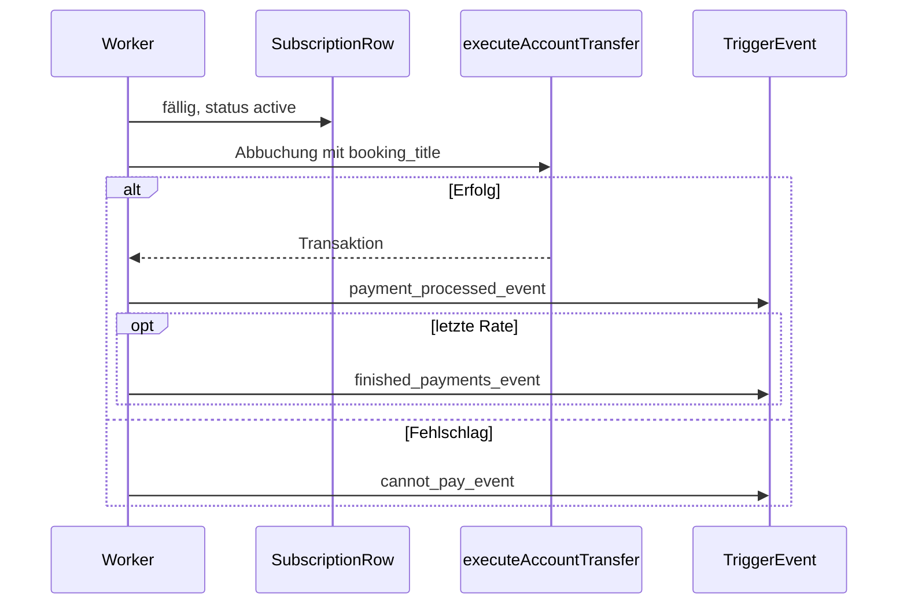

# Subscription-API (Exports + Server-Events)

Diese API richtet sich an **integrierende Resources** (und Coding Agents), die wiederkehrende Abbuchungen mit **konfigurierbaren Server-Events** benötigen. Sie ergänzt den Legacy-Export `create_subscription(debtor, creditor, amount, intervalSeconds, metadata)` um ein **tabellenbasiertes** Modell mit `external_id`, numerischer `subscription_id` und `TriggerEvent`-Payloads.

## Vertrauen und Ownership

1. **`Config.paymentInstructionsTrustedResources`** in `config.lua`: Nur eingetragene Resource-Namen (plus die Banking-Resource selbst, wenn die Liste leer ist) dürfen die Subscription-Exports aufrufen — identisch zu `create_subscription` / `suspend_subscription_system`.
2. **Owner-Scoping**: Jede Zeile speichert `owner_resource = GetInvokingResource()` beim Anlegen. **Lesen und mutieren** über `external_id` ist nur für `owner_resource == aufrufende Resource` erlaubt. Fremde Resources erhalten `forbidden` / `not_found`.

## Datenhaltung

- Tabelle `bank_payment_instructions`, `kind = 'subscription'`.
- Spalten: `subscription_internal_id` (eindeutig, numerisch; entspricht **`subscription_id` in Events**), `owner_resource`, `external_id` (Schlüssel der integrierenden Resource), plus bestehende Felder (`debtor_account_id` = Sender, `creditor_target` = Empfänger, …).
- Zusätzliche Felder liegen in **`metadata`** (JSON): `payments_completed`, `user_can_cancel`, `booking_title`, Event-Namen-Strings, `max_payments`, `system_suspended` (System-Pause via `suspend_subscription_system`), usw.

## Schedule (Phase 1)

`schedule.interval_seconds` — Mindestintervall wie bei anderen Zahlungsplänen (Serverkonstante, aktuell 60 Sekunden). Änderung per `updateSubscription` setzt `next_run_at` neu auf **nächsten Slot ab jetzt** (`advanceNextRun(now())`).

---

## Exports (Lua)

Ersetze `YourResourceName` durch den **Ordnernamen** der Banking-Resource.

### `createSubscription(data)` → `subscription_id, err`

| Feld `data` | Pflicht | Typ | Beschreibung |
|-------------|---------|-----|--------------|
| `external_id` | ja | string | Eindeutiger Schlüssel **pro Owner-Resource** |
| `sender_account` | ja* | string | Abbuchungskonto (Alias: `debtor_account_id`) |
| `receiver_account` | ja* | string | Ziel (Alias: `creditor_target`) |
| `amount` | ja | number | Betrag pro Lauf (≥ 1) |
| `schedule` | ja | table | `schedule.interval_seconds` (number, ≥ Minimum) |
| `booking_title` | nein | string | Anzeige-/Buchungstitel (Fallback: `"Subscription"`) |
| `user_can_cancel` | nein | boolean | Wird in Cancel/Pause-Payloads mitgegeben |
| `payment_processed_event` | ja | string | Server-Event bei **erfolgreicher** Abbuchung (nicht leer) |
| `cancel_subscription_event` | ja | string | Server-Event bei Kündigung (nicht leer) |
| `cannot_pay_event` | ja | string | Server-Event bei **fehlgeschlagener** Abbuchung (nicht leer) |
| `finished_payments_event` | bedingt | string | **Pflicht**, wenn `max_payments` gesetzt (≥ 1); sonst optional |
| `subscription_paused_event` | nein | string | Server-Event bei Wechsel zu `paused` |
| `max_payments` | nein | number | Obergrenze erfolgreicher Läufe; danach `status = completed` |

**Erfolg:** `subscription_id` (number) = `subscription_internal_id`. **Fehler:** `nil, err` mit z. B. `untrusted`, `duplicate_external_id`, `invalid_events`, `finished_event_required`, `invalid_max_payments`, `db`.

### `updateSubscription(external_id, patch)` → `ok, err`

`patch` ist optional pro Feld. Erlaubt u. a.: `sender_account` / `debtor_account_id`, `receiver_account` / `creditor_target`, `amount`, `booking_title`, `schedule`, `user_can_cancel`, alle Event-Strings, `max_payments` (`false` = unbegrenzt).  
**Nicht** erlaubt bei `status == completed` → `completed`.  
`max_payments` darf nicht unter `payments_completed` liegen (`max_below_completed`).  
Wenn nach dem Merge ein finites `max_payments` (≥ 1) gesetzt ist, muss `finished_payments_event` nicht leer sein.

### `pauseSubscription` / `resumeSubscription` / `cancelSubscription(external_id)` → `ok, err`

- **Pause / Resume / Cancel** nur für API-Subscriptions (`subscription_internal_id` gesetzt). Legacy-Zeilen: `legacy_subscription`.
- **Cancel** und **completed**: nicht kombinierbar (`completed`).
- **Pause** feuert optional `subscription_paused_event` (wenn konfiguriert).
- **Cancel** feuert `cancel_subscription_event` (wenn konfiguriert; auch bei `cancel_payment_instruction` mit `instruction_id`, wenn API-Zeile).

### `getSubscriptionByExternalId(external_id)` → `row, err`

Sanitisierte Tabelle (keine nicht-serialisierbaren Typen) mit u. a. `instruction_id`, `subscription_id`, Konten, `status`, `metadata`, Zeitstempel.

### `listSubscriptions()` → `rows, err`

Alle API-Subscriptions mit `owner_resource == GetInvokingResource()`.

### `isSubscriptionActive(external_id)` → `boolean`

`true` nur wenn: Zeile existiert, Owner passt, `status == active`, nicht `system_suspended`, Scheduler darf laufen.

### `findActiveSubscription(sender_account, receiver_account, external_id?)` → `row, err`

Erste **aktive** API-Subscription des Owners mit passendem Sender/Empfänger; optional eingeschränkt auf `external_id`.

### Legacy

`create_subscription(...)` bleibt unverändert (keine `subscription_internal_id`, **keine** Event-Pipeline dieser API).  
`cancel_payment_instruction(instruction_id)` kündigt weiterhin per PK; bei API-Zeilen wird zusätzlich `cancel_subscription_event` ausgelöst (wenn gesetzt).

---

## Server-Events (`TriggerEvent`)

Registrierung in der **konsumierenden** Resource auf dem Server:

```lua
AddEventHandler('my_resource:subscription_paid', function(payload)
    -- payload.subscription_id, payload.external_id, ...
end)
```

Es wird ausschließlich **`TriggerEvent(name, payload)`** auf dem Server ausgeführt (kein Client). Wenn Clients informiert werden sollen, muss die empfangende Resource selbst `TriggerClientEvent` aufrufen.

### Gemeinsame Payload-Grundlage (erfolgreiche / finale Zahlung)

| Key | Typ | Beschreibung |
|-----|-----|--------------|
| `subscription_id` | number | `subscription_internal_id` |
| `instruction_id` | string | Primärschlüssel in `bank_payment_instructions` |
| `external_id` | string | Von der Resource vergebene ID |
| `owner_resource` | string | `GetInvokingResource()` beim `createSubscription` |
| `sender_account` | string | `debtor_account_id` |
| `receiver_account` | string | `creditor_target` |
| `amount` | number | Abgebuchter Betrag (dieser Lauf) |
| `booking_title` | string | Stammtitel |
| `booking_title_resolved` | string | Titel inkl. Transaktionsdarstellung |
| `transaction_number` | string | Kompakte Form, z. B. aus UUID ohne Bindestriche, Präfix `#` |
| `processed_at` | string | `YYYY-MM-DD HH:MM:SS` (Serverzeit) |
| `payments_completed` | number | Anzahl erfolgreicher Läufe **nach** diesem Lauf |
| `max_payments` | number \| nil | Obergrenze oder `nil` bei unbegrenzt |
| `is_final_payment` | boolean | `true`, wenn dies die letzte geplante Rate war |

### `cannot_pay_event`

Wie oben, aber **ohne** erfolgreiche Buchung: `payments_completed` = Stand **vor** diesem fehlgeschlagenen Versuch, `is_final_payment = false`, `transaction_number` leer, plus:

| Key | Typ | Beschreibung |
|-----|-----|--------------|
| `failure_reason` | string | z. B. `insufficient_funds`, `debtor_offline_personal`, `creditor_offline`, `invalid_amount` |

### `cancel_subscription_event`

| Key | Typ |
|-----|-----|
| `subscription_id`, `instruction_id`, `external_id`, `owner_resource`, `sender_account`, `receiver_account`, `amount` |
| `user_can_cancel` | boolean (gespeichertes Flag) |
| `cancelled_at` | string `YYYY-MM-DD HH:MM:SS` |

### `subscription_paused_event`

| Key | Typ |
|-----|-----|
| `subscription_id`, `instruction_id`, `external_id`, `owner_resource`, `sender_account`, `receiver_account`, `amount` |
| `user_can_cancel` | boolean |
| `paused_at` | string |

### `finished_payments_event`

Nur nach der **letzten** erfolgreichen Buchung, wenn `max_payments` gesetzt und der Eventname nicht leer ist. **Reihenfolge:** zuerst `payment_processed_event`, dann `finished_payments_event` mit denselben Feldern wie die erfolgreiche Zahlung plus:

| Key | Typ |
|-----|-----|
| `finished_at` | string (identisch zu `processed_at` dieser Buchung) |

---

## Ablauf (Überblick)



---

## Hinweise für Coding Agents

- Immer **Resource-Namen** im Export-String prüfen (Ordnername ≠ Anzeigename in `fxmanifest`).
- Vor `createSubscription` **`external_id`** idempotent wählen oder auf `duplicate_external_id` reagieren.
- Für „läuft das Abo?“ primär **`isSubscriptionActive`** nutzen statt eigene DB-Logik.
- **`suspend_subscription_system`** ist unabhängig von dieser API: setzt nur `metadata.system_suspended`; löst **keine** der konfigurierbaren Events aus (bewusst getrennt).

Weitere Zahlungspläne: [11-recurring-payments.md](11-recurring-payments.md). Gesamt-Exports: [10-exports-api.md](10-exports-api.md).
